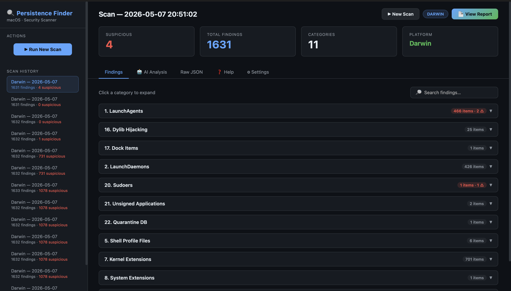

# Persistence Finder

A macOS-first (also Linux & Windows) persistence mechanism scanner with a beautiful web UI, AI-powered triage, and automated investigation.

[](https://opensource.org/licenses/MIT)
[](https://www.python.org/downloads/)
[](https://github.com/iampopg/persistence-finder)

> **Created by [@iampopg](https://github.com/iampopg)**



---

## ⚠️ Disclaimer

**For authorized security assessments only.** Only use on systems you own or have explicit written permission to scan. The authors assume no liability for misuse.

---

## ✨ What It Does

- **Scans** your system for all known persistence mechanisms (22 on macOS, 15 on Linux, 20 on Windows)
- **AI triage during scan** — sends each category to your local or cloud AI to filter out false positives in real time
- **Web UI** — full browser-based interface, no CLI needed
- **AI Analysis tab** — post-scan deep analysis, identifies real threats vs false positives
- **AI Investigation** — click Investigate on any threat, AI runs read-only commands autonomously and gives a verdict (Malicious / Suspicious / Clean)
- **Report** — view a full HTML report in a new tab with all findings and AI-identified threats

---

## 🚀 Quick Start

```bash
git clone https://github.com/iampopg/persistence-finder.git
cd persistence-finder

pip install -r requirements.txt

# Copy the settings template
cp ai_settings.example.json ai_settings.json

# Start the web UI
python3 web/app.py
```

Open **http://localhost:5001** in your browser.

---

## 🤖 AI Setup

Configure AI in the **⚙ Settings** tab of the web UI. Two providers supported:

### Ollama (local, free, private)
```bash
# Install Ollama: https://ollama.ai
ollama pull deepseek-r1
```
Set URL to `http://localhost:11434`, click Detect, select model, Save.

### Groq (cloud, free tier)
Get a free API key at [console.groq.com](https://console.groq.com).  
Best free model: **llama-4-scout-17b** (30K TPM, 500K TPD).

---

## 🛡️ Detection Coverage

### macOS — 22 Techniques
| # | Technique | Risk |
|---|-----------|------|
| 1 | LaunchAgents (user + system) | High |
| 2 | LaunchDaemons | High |
| 3 | Login Items (BTM database) | Medium |
| 4 | Cron Jobs | High |
| 5 | Shell Profile Files (.zshrc, .bashrc…) | High |
| 6 | Startup Items (legacy) | Medium |
| 7 | Kernel Extensions (.kext) | Critical |
| 8 | System Extensions (DriverKit) | High |
| 9 | SSH Authorized Keys | Critical |
| 10 | At Jobs | Low |
| 11 | Periodic Scripts (daily/weekly/monthly) | Medium |
| 12 | Config Profiles (MDM) | High |
| 13 | Emond Rules | High |
| 14 | XPC Services | Medium |
| 15 | Login/Logout Hooks (legacy) | High |
| 16 | Dylib Hijacking (DYLD_INSERT_LIBRARIES) | Critical |
| 17 | Dock Items | Low |
| 18 | Spotlight Importers (.mdimporter) | Medium |
| 19 | Browser Extensions (Chrome/Safari/Firefox) | Medium |
| 20 | Sudoers | High |
| 21 | Unsigned Applications | Medium |
| 22 | Quarantine Database | Low |

### Linux — 15 Techniques
Cron Jobs, Systemd Services/Timers, RC Scripts, Shell Profiles, SSH Keys, Kernel Modules (LKM), eBPF, LD_PRELOAD, Udev Rules, PAM Modules, At Jobs, XDG Autostart, MOTD Scripts, Systemd Unit Files, Profile.d Scripts

### Windows — 20 Techniques
Registry Run Keys, Startup Folders, Scheduled Tasks, Services, Winlogon DLL, Accessibility Features, AppInit DLLs, WMI Subscriptions, LSASS/SSP, IFEO, Netsh Helpers, Port Monitors, Auth Packages, Time Providers, Active Setup, COR_PROFILER, SilentProcessExit, BITS Jobs, Startup Approved, Boot Execute

---

## 🌐 Web UI Features

| Tab | What it does |
|-----|-------------|
| **Findings** | All scan results, collapsible by category, search, 🔬 Investigate button on each item |
| **🤖 AI Analysis** | Sends all findings to AI, renders threat cards with severity + why + MITRE technique |
| **Raw JSON** | Full scan data, download as JSON |
| **❓ Help** | How it works, technique descriptions, AI setup guide |
| **⚙ Settings** | AI provider (Ollama/Groq), API key, model selection, test connection |

---

## 🔬 AI Investigation

Click **🔬 Investigate** on any threat card. The AI:
1. Decides which read-only command to run (e.g. `codesign -dvvv /path`, `sudo cat /etc/sudoers`)
2. We run it — only safe commands allowed (no modifications, no network)
3. AI reads the output and decides: next command, or final verdict
4. Up to 6 rounds, streamed live in the modal
5. Final verdict: 🚨 **MALICIOUS** / ⚠ **SUSPICIOUS** / ✅ **CLEAN**

Click **⏹ Stop** to cancel at any time.

---

## 📁 Project Structure

```
persistence-finder/
├── core/                    # Shared helpers (system_info, utils, forensic_helpers)
├── docs/                    # Documentation + README
├── scanners/
│   ├── macos_scanner.py     # 22 macOS persistence techniques
│   ├── linux_scanner.py     # 15 Linux techniques
│   └── windows_scanner.py   # 20 Windows techniques
├── web/
│   ├── app.py               # Flask backend (scan, AI, investigate, report)
│   ├── static/
│   │   ├── style.css        # Dark cybersecurity theme
│   │   └── app.js           # Frontend logic
│   └── templates/
│       └── index.html       # Single-page app
├── scans/                   # Scan results (gitignored)
├── ai_settings.json         # Your AI config (gitignored — contains API key)
├── ai_settings.example.json # Empty template (safe to commit)
├── main.py                  # CLI entry point
└── requirements.txt
```

---

## 🔒 Security Notes

- **Read-only** — the tool never modifies, deletes, or executes anything on your system
- **Local AI** — with Ollama, no data leaves your machine
- **Safe commands only** — the investigation feature uses a strict whitelist; `rm`, `curl`, `chmod` etc. are blocked
- **API key safety** — `ai_settings.json` is gitignored; only the empty example is committed

---

## 📋 Requirements

- Python 3.8+
- `pip install -r requirements.txt` (Flask, requests, colorama, pyfiglet)
- Admin/root for complete scanning (some techniques require elevated privileges)

---

## 🤝 Contributing

1. Fork the repo
2. Create a branch: `git checkout -b feature/my-feature`
3. Commit: `git commit -m 'Add my feature'`
4. Push: `git push origin feature/my-feature`
5. Open a Pull Request

---

## 📜 License

MIT License — Copyright (c) 2025 [@iampopg](https://github.com/iampopg)

If you use or modify this code, please credit **[@iampopg](https://github.com/iampopg)** and link back to this repository.

---

**Made with ❤️ by [@iampopg](https://github.com/iampopg) — for authorized security testing only.**
